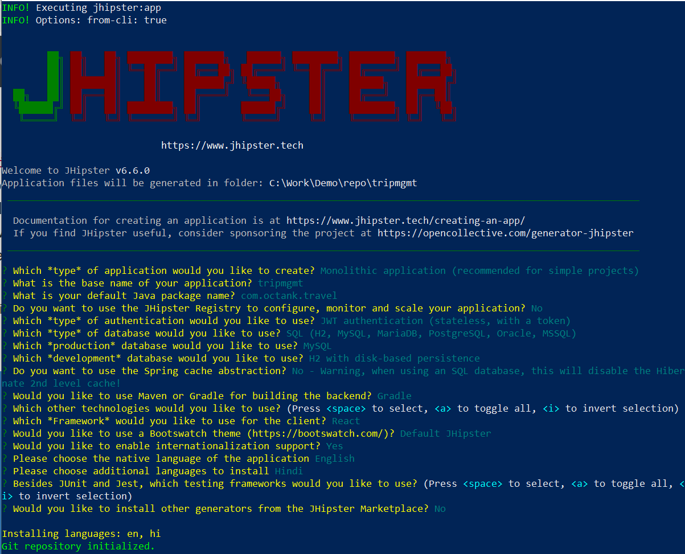

# ECS Reference Architecture: Continous Deployment Pipeline - Application Setup

<!-- TABLE OF CONTENTS -->
## Table of Contents

* [Application Setup](#application-setup)
  * [Install JHipster](#install-jhipster)
  * [Create Monolith Application](#create-monolith-application)
  * [Modify Application Demo for Trip Management usecase](#modify-application-demo-for-trip-management-usecase)

<!-- Application Setup -->
## Application Setup

We shall be using Jhipster Generator to generate code of our monolith application and modify homepage to personalize for use case of ficticious company Octank.

_About JHipster_ : Jhipster is an Apache-licensed open source project that allows you to generate Spring Boot APIs, as well as Angular or React or Vuejs UIs. It includes support for generating CRUD screens and adding all the necessary plumbing. It even generates microservice architectures!

### Install JHipster

```sh 
npm install -g generator-jhipster
```

### Create Monolith Application

* Let's create directory to put our application code and run JHipster and follow instructions on screen

    ```sh
    mkdir tripmgmt && cd tripmgmt
    jhipster
    ```
    

* Give one by one answer to each configurable option questions and at the end complete application is generated with git repo initialization.

    

* Copy `references` folder from [awsdevopsecs][awsdevopsecs-github-url] Git repo to project folder.

    * move _Dockerfile_ and _entrypoint&#46;sh_ files from `references` folder to project root folder.

* Build application and create docker image.
    ```sh
    ./gradlew bootWar -Pprod -Pwar
    docker build -t tripmgmt .
    ```
* Test production release application locally through docker-compose.
    ```sh
    docker-compose -f src/main/docker/app.yml up 
    docker-compose -f src/main/docker/app.yml down # Once you are done with testing.
    ```
* Great ! You have successfully created Java and React based Monolith Application. If you want to customize it for demo, then follow along next section, else you can directly jump to AWS section for deploying through DevOps services.

* Note: Jhipster provides `jhipster aws` and `jhipster aws-containers` [generator options](https://www.jhipster.tech/aws/), which deploys to AWS ECS with Fargate launch type. However, it has limited support and all setup is done with cloudformation template. So, not a good option if you want to learn and explore AWS DevOps services and Amazon ECS with deep dive approach.

### Modify Application Demo for Trip Management usecase

1. Modify Jhipster boilerplate application to add Trips domain model. You can create your own data model through [JDL Studio](https://start.jhipster.tech/jdl-studio/) and import locally. For this demo, you can refer available trip.jh.

    ```sh
    cd <<PROJECT_ROOT>>
    jhipster import-jdl references\trip.jh # overwrite yes to all prompts
    ```

2. Copy **overwrite** provided `references\ui\favicon.ico` at `<<PROJECT_ROOT>>\src\main\webapp\`
3. Copy **overwrite** provided `references\ui\logo-jhipster.png` at `<<PROJECT_ROOT>>\src\main\webapp\content\images`
3. **Copy** provided `references\ui\octank_mb.png` at `<<PROJECT_ROOT>>\src\main\webapp\content\images` and **Edit** `<<PROJECT_ROOT>>\src\main\webapp\app\modules\home\home.scss` to replace `jhipster_family_member_2.svg` with `octank_mb.png`

4. **Edit** `<<PROJECT_ROOT>>\src\main\webapp\i18n\en\global.json` to  
	1. Update "title" to "Trip Management".
	2. Update "footer" to "© 2020, Octank, Inc. or its affiliates. All rights reserved."

5. Copy **overwrite** provided `references\ui\home.json` at `<<PROJECT_ROOT>>\src\main\webapp\i18n\en\`.
6. Copy **overwrite** provided `references\ui\home.tsx` at `<<PROJECT_ROOT>>\src\main\webapp\app\modules\home\`. 
7. Verify changes locally through steps mentioned in previous section.

\
\
[Deployment Setup](deploysetup.md#deployment-setup)

[Project Home](README.md)