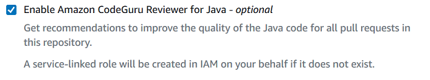

# ECS Reference Architecture: Continous Deployment Pipeline - Deployment Setup

<!-- TABLE OF CONTENTS -->
## Table of Contents

* [Deployment Setup](#deployment-setup)
  * [Create required AWS IAM Roles](#create-required-aws-iam-roles)
  * [Create CodeCommit and Container Repository](#create-codecommit-and-container-repository)
  * [Setup Aurora MySQL RDS Database](#setup-aurora-mysql-rds-database)
  * [Setup Amazon ECS with Autoscaling Amazon EC2](#setup-amazon-ecs-with-autoscaling-amazon-ec2)

## Deployment Setup

* Assume you have configured AWS CLI as given in pre-requisites. 
* Use single region (default region specified in AWS CLI configuration) where you would setup services in below applicable sections.

    *Note : This demo may require services which are not part of [AWS Free Tier](https://aws.amazon.com/free/)*

### Create required AWS IAM Roles

Check and create IAM roles, if it doesn't exist (in case, you have created for your earlier excercies, skip creating it again).

1. **Task Execution Role**: The Amazon ECS container agent make calls to the Amazon ECS API on your behalf, so it requires an IAM policy and role for the service to know that the agent belongs to you. This IAM role is referred to as a task execution IAM role.\
\
To create the `ecsTaskExecutionRole` IAM role

    1. Open the [IAM console](https://console.aws.amazon.com/iam/)
    2. In the navigation pane, choose **Roles, Create role.**
    3. In the **Select type of trusted entity** section, choose **Elastic Container Service**.
    4. For **Select your use case**, choose **Elastic Container Service Task**, then choose **Next: Permissions**.
    5. In the **Attach permissions policy** section, search for **AmazonECSTaskExecutionRolePolicy**, select the policy, and then choose **Next: Review**.
    6. For **Role Name**, type `ecsTaskExecutionRole` and choose **Create role**.

2. **ECS Instance Role**: This IAM role is required for the EC2 launch type. The Amazon ECS container agent makes calls to the Amazon ECS API on your behalf. Container instances that run the agent require an IAM policy and role for the service to know that the agent belongs to you.\
\
To create the `ecsInstanceRole` IAM role

    1. Open the [IAM console](https://console.aws.amazon.com/iam/)
    2. In the navigation pane, choose **Roles, Create role.**
    3. Choose the **AWS service** role type, and then choose **Elastic Container Service**.
    4. Choose the **EC2 Role for Elastic Container Service** use case and then **Next: Permissions**.
    5. In the **Attached permissions policy** section, select **AmazonEC2ContainerServiceforEC2Role** and then choose **Next: Review**.
    6. For **Role Name**, type `ecsInstanceRole` and choose **Create role**.

3. **ECS CodeDeploy Role**: Before you can use the CodeDeploy blue/green deployment type with Amazon ECS, the CodeDeploy service needs permissions to update your Amazon ECS service on your behalf. These permissions are provided by the CodeDeploy IAM role.\
\
To create the `ecsCodeDeployRole` IAM role

    1. Open the [IAM console](https://console.aws.amazon.com/iam/)
    2. In the navigation pane, choose **Roles, Create role.**
    3. Choose the **AWS service** role type, and then choose **CodeDeploy**.
    4. Choose the **CodeDeploy** use case and then **Next: Permissions**.
    5. For **Role Name**, type `ecsCodeDeployRole` and choose **Create role**.
    6. Open 'ecsCodeDeployRole` role again from [IAM console](https://console.aws.amazon.com/iam/), to add the required additional permissions.
    7. Choose **Attach policies**.
    8. To narrow the available policies to attach, for **Filter**, type **AWSCodeDeployRoleForECS**
    9. Check the box to the left of the **AWS managed policy** and choose **Attach policy** and **Update**.

4. **Service Linked Role for Amazon ECS**: Amazon ECS uses the service-linked role named **AWSServiceRoleForECS** to enable Amazon ECS to call AWS APIs on your behalf. The **AWSServiceRoleForECS** service-linked role trusts the `ecs.amazonaws.com` service principal to assume the role. Under most circumstances, this role should already exist, if not

    To create a service-linked role (CLI)
    ```sh
    aws iam create-service-linked-role --aws-service-name ecs.amazonaws.com
    ```

5. **Service Linked Role for Amazone EC2 Auto Scaling**: Amazon EC2 Auto Scaling uses service-linked roles for the permissions that it requires to call other AWS services on your behalf. Amazon EC2 Auto Scaling uses the **AWSServiceRoleForAutoScaling** service-linked role. Under most circumstances, this role should already exist, if not

    To create a service-linked role (CLI)
    ```sh
    aws iam create-service-linked-role --aws-service-name autoscaling.amazonaws.com
    ```

### Create CodeCommit and Container Repository

**Create a CodeCommit repository**

1. Open the [CodeCommit console home](https://console.aws.amazon.com/codesuite/codecommit/).
2. In the region selector, choose the `default region`.
3. On the **Repositories** page, choose **Create repository**.
4. On the **Create repository** page, in **Repository name**, enter a name for the repository (i.e. `tripmgmtdemo`)

    *Note : Repository names are case sensitive. The name must be unique in the AWS Region for your AWS account.*
5. (Optional) In **Description**, enter a description for the repository. This can help you and other users identify the purpose of the repository.

6. (Optional) Select **Enable Amazon CodeGuru Reviewer for Java** if this repository will contain Java code, and you want CodeGuru Reviewer to analyze that Java code. CodeGuru Reviewer uses multiple machine learning models to find Java code defects and to automatically suggest improvements and fixes in pull requests. For more information, see the [Amazon CodeGuru Reviewer User Guide](https://docs.aws.amazon.com/codeguru/latest/reviewer-ug/Welcome.html).

    

7. Choose **Create**.
8. Configure access to CodeCommit Repository from your local git client, make sure you have downloaded `HTTPS Git credentials for AWS CodeCommit` from [IAM console](https://console.aws.amazon.com/iam/) for your respective IAM User.

    

9. Add remote origin to project Git repo.

    ```sh
    git remote add origin <<HTTPS CodeCommit Repo URL>>
    git push origin master
    ````

**Create Container repository**

1. Open the [Amazon ECR console](https://console.aws.amazon.com/ecr/repositories).
2. From the navigation bar, choose the **Region** (i.e. `default region`) to create your repository in
3. In the navigation pane, choose **Repositories**.
4. On the **Repositories** page, choose **Create repository**.
5. For **Repository name**, enter a unique name for your repository (i.e. `devops/tripmgmtdemo`)
    
    

6. For **Tag immutability**, choose the tag mutability setting for the repository. Repositories configured with immutable tags will prevent image tags from being overwritten. For more information, see [Image Tag Mutability](https://docs.aws.amazon.com/AmazonECR/latest/userguide/image-tag-mutability.html).
7. For **Scan on push**, choose the image scanning setting for the repository. Repositories configured to scan on push will start an image scan whenever an image is pushed, otherwise image scans need to be started manually. For more information, see [Image Scanning](https://docs.aws.amazon.com/AmazonECR/latest/userguide/image-scanning.html).
8. Choose **Create repository**.
9. Copy Repository URL to be used in subsequent sections.

#### Setup Aurora MySQL RDS Database

In this section, we will setup Aurora MySQL RDS with Multi-AZ configuration.

1. Sign in to the AWS Management Console and open the [Amazon RDS console](https://console.aws.amazon.com/rds/).
2. In the upper-right corner of the AWS Management Console, choose the `default region` in which we will create the DB cluster.
3. In the navigation pane, choose **Databases**.
4. Choose **Create database**.
5. In **Choose a database creation method**, choose **Standard Create**.
6. In **Engine options**, choose **Amazon Aurora**.

    

7. In **Edition**, choose *Amazon Aurora with MySQL compatibility*
8. Choose *One writer and multiple readers* in **Database features**
9. In **Templates**, choose *Dev/Test* template.
10. To enter your master password, do the following:
    1. In the **Settings** section, open **Credential Settings**.
    2. Clear the **Auto generate a password** check box.
    3. (Optional) Change the **Master username** value and enter the same password in **Master password** and **Confirm password**, for example (admin/mysql123)

11. For **DB instance size**, choose `db.t3.small`
12. For **Availability & durability**, choose *Create an Aurora Replica/Reader node in a different AZ (recommended for scaled availability)*
13. For **Connectivity**, defaults.
14. For **Additional configuration**
    1. **DB instance identifier**, enter *tripmgmt-demo-aurora*
    2. **Initial database name**, enter *tripmgmt*
    3. **Monitoring**, _uncheck_ Enable Enhanced monitoring

15. Choose **Create database**.
16. For **Databases**, choose the name of the new Aurora DB cluster.

    On the RDS console, the details for new DB cluster appear. The DB cluster and its DB instance have a status of **creating** until the DB cluster is ready to use. When the state changes to **available** for both, you can connect to the DB cluster. Depending on the DB instance class and the amount of storage, it can take up to 20 minutes before the new DB cluster is available.
              
17. On the **Connectivity & security** tab, note the port and the endpoint of the writer DB instance. Please make a note of the endpoint and port of the cluster.

### Setup Amazon ECS with Autoscaling Amazon EC2


#### Create Your Application Load Balancer and Target Groups

In this section, you will create an Amazon EC2 application load balancer. You use the subnet names, and target group values you create with your load balancer later, when you create your Amazon ECS service.

The load balancer must use a VPC with two public subnets in different Availability Zones. In these steps, you confirm your default VPC, create a load balancer, and then create two target groups for your load balancer. 


**To create an Amazon EC2 application load balancer**

1. Sign in to the AWS Management Console and open the [Amazon EC2 console](https://console.aws.amazon.com/ec2/)
2. In the navigation pane, choose **Load Balancers**, choose **Create Load Balancer**.
3. Choose **Application Load Balancer**, and then choose **Create**.

    

4. In **Name**, enter the name of your load balancer i.e. `tripmgmtdemo-alb`
5. In **Scheme**, choose **internet-facing**.
6. In **IP address type**, choose **ipv4**.
7. Configure two listener ports for your load balancer:
    1. Under **Load Balancer Protocol**, choose **HTTP. Under Load Balancer Port**, enter `80`.
    2. Choose **Add listener**.
    3. Under **Load Balancer Protocol** for the second listener, choose **HTTP. Under Load Balancer Port**, enter `8080`.
8. Under **Availability Zones**, in **VPC**, choose the default VPC. Next, choose two default subnets you want to use. _**Make a note of subnet ids to use in later part of this tutorial**_
9. Choose **Next: Configure Security Settings**.
10. Choose **Next: Configure Security Groups**.
11. Choose **Create new security group**, 
    1. Allow `80` port (HTTP) inbound traffic from your IP
    2. Allow `8080` port (CustomTCPPort) inbound traffic from your IP 
12. Choose **Next: Configure Routing**.
13. In **Target group**, choose **New target group** and configure your first target group:
    1. In **Name**, enter a target group name (for example, `alb-tg-tripmgmtdemo-1` ).
    2. In **Target type**, choose **IP**.
    3. In **Protocol** choose **HTTP**. In **Port**, enter `80`.
    4. Choose **Next: Register Targets**.
14. Choose **Next: Review**, and then choose **Create**.

**To create a second target group for your load balancer**

1. After your load balancer is provisioned, open the Amazon EC2 console. In the navigation pane, choose **Target Groups**.
2. Choose **Create target group**.

    

3. In **Name**, enter a target group name (for example, `alb-tg-tripmgmtdemo-2`).
4. In **Target type**, choose **IP**.
5. In **Protocol** choose **HTTP**. In **Port**, enter `8080`.
6. In **VPC**, choose the default VPC.
7. Choose **Create**.

    *Note: You must have two target groups created for your load balancer in order for your deployment to run. You only need to make a note of the ARN of your first target group. This ARN is used in the create-service JSON file in the next section.*

**To update your load balancer to include your second target group**

1. Open the Amazon EC2 console. In the navigation pane, choose **Load Balancers**.
2. Choose your load balancer, and then choose the **Listeners** tab. Choose the listener with port 8080, and then choose **Edit**.
3. Choose the pencil icon next to **Forward to**. Choose your second target group, and then choose the check mark. Choose **Update** to save the updates.

    


#### Create ECS Cluster with Autoscaling

Amazon ECS cluster auto scaling can be set up and configured using the AWS Management Console, AWS CLI, or Amazon ECS API. I will walk you through creating the resources for cluster auto scaling using the AWS Management Console to understand each service and parameter options in detail.

**Create an Amazon ECS cluster**

Use the following steps to create an Amazon ECS cluster. We will create an empty cluster so that we can manually create the Auto Scaling resources. When you use the AWS Management Console to create a non-empty cluster, Amazon ECS creates an AWS CloudFormation stack along with Auto Scaling resources. We want to avoid creating this AWS CloudFormation stack when using the cluster auto scaling feature.

1. Open the [Amazon ECS console](https://console.aws.amazon.com/ecs/).
2. On the navigation bar at the top of the screen, select `default region`.
3. In the navigation pane, choose **Clusters**.
4. On the **Clusters** page, choose **Create Cluster**.
5. For **Select cluster compatibility**, choose **EC2 Linux + Networking** and then choose **Next step**.

    

6. For **Cluster name**, enter `ecs-cluster-tripmgmtdemo` for the cluster name.
7. Select **Create an empty cluster** and then choose **Create**.

**Prepare Task Definition and Create ECS Task**

A task definition is required to run Docker containers in Amazon Elastic Container Service. You can define multiple containers in a task definition. The parameters that you use depend on the launch type you choose for the task.

1. First create cloud watch log group, where taskdef is configured to send all logs.
    1. Go to [Cloudwatch Console](https://console.aws.amazon.com/cloudwatch/)
    2. Select **Log Groups**, 
    3. Click **Actions** dropdown and select **Create log group** 
    4. **Log Group Name:** enter `tripmgmt-demo-ecstask-loggrp`
2. Edit `taskdef.json` file, located at `<<PROJECT_ROOT>>\references\taskdef.json`
    1. Replace <<TASK_EXECUTION_ROLE_ARN>> with the one created in one of the above section.
    2. Replace <<LOG_GROUP>> with the one created above `tripmgmt-demo-ecstask-loggrp`
    3. Replace <<DEFAULT_REGION>> with the region in which you have created this demo resources
    4. Replace <<AURORA_MYSQL_RDS_URL>> with Aurora MySQL RDS Cluster URL.
    5. Replace <<DB_USERNAME>> with Database username for example `admin`
    6. Replace <<DB_PASSWORD>> with Database password for example `mysql123`. *Note: This is for dev/test purpose only, in production you can use AWS SSM service, with Spring Boot.*
    7. Replace <<ECR_LATEST_IMAGE_URL>> with Elastic Container Registry Image URL, it should be of the form __*accountid*.dkr.ecr.*region*.amazonaws.com/*repository name*:latest__
3. Create Taskdef from commandline

    ```sh
    aws ecs register-task-definition --cli-input-json file://taskdef.json
    ```
4. Capture the TaskDefinition ARN from output.
5. Commit `taskdef.json` in repository.
6. You can also verify Task in [Amazon ECS console](https://console.aws.amazon.com/ecs/), left navigation bar under **Amazon ECS**, **Task Definitions**.

**Prepare AppSpec File**

AppSpec file is a YAML-formatted file used by CodeDeploy to manage a deployment. 

1. Edit `appspec.yaml` file, located at `<<PROJECT_ROOT>>\references\appspec.yaml`
    1. Replace <<TASKDEF_ARN>> with previously created Task Definition, it should be of the form __arn:aws:ecs:*region*:*accountid*:task-definition/*taskname*:1__
    2. Replace <<CONTAINER_NAME>> with the actual container name - refer task definition file (i.e. `cntr-img-tripmgmt`)
2. Commit `appspec.yaml` in repository. 

**Create the Auto Scaling Resources**

*Create an Auto Scaling launch configuration*

1. Open the [Amazon EC2 console](https://console.aws.amazon.com/ec2/).
2. On the navigation bar at the top of the screen, select `default region`.
3. On the navigation pane, under **Auto Scaling**, choose **Launch Configurations**.
4. On the next page, choose **Create launch configuration**.
5. On the **Choose AMI** page, search for and choose the latest `Amazon ECS-optimized Amazon Linux 2` AMI.

    

6. On the **Choose Instance Type** page, select `t3.2large`, then choose **Next: Configure details**. Here, `t3.2xlarge` selected as an example, you can choose EC2 Instance size as per your need.

7. On the **Configure details** page, do the following:
    1. For **Name**, enter `ASGLaunchConfig-TripmgmtDemo` for the launch configuration name.
    2. For **IAM role**, select already created container instance IAM role.
    3. Expand the **Advanced Details** section to specify user data for your Amazon ECS container instances.

        Paste the following script into the **User data** field. The `ecs-cluster-tripmgmtdemo` cluster was created in above step.

        ```sh
        #!/bin/bash
        echo ECS_CLUSTER=ecs-cluster-tripmgmtdemo >> /etc/ecs/ecs.config
        ```
    4. Choose **Skip to review**.
8. Choose **Create launch configuration**.

Next, create an Auto Scaling group using that launch configuration.

*To create an Auto Scaling group*

1. Open the [Amazon EC2 console](https://console.aws.amazon.com/ec2/).
2. On the navigation bar at the top of the screen, select `default region`.
3. On the navigation pane, under **Auto Scaling**, choose **Launch Configurations**.
4. On the next page, select the launch configuration we created in above step and choose **Create Auto Scaling group**.

    

5. On the **Configure Auto Scaling group** details page, do the following:
    1. For **Group name**, enter `ASG-TripmgmtDemo` for the Auto Scaling group name.
    2. For **Group size**, enter 0. We will use Amazon ECS managed scaling so there is no need to have the Auto Scaling group launch any initial instances.
    3. For **Network**, choose a VPC for your Auto Scaling group.
    4. For **Subnet**, choose same subnets in your VPC which was selected for Application Load Balancer section.
    5. Expand the **Advanced Details** section. For **Instance Protection**, choose **Protect From Scale In**. This enables you to use managed termination protection for the instances in the Auto Scaling group, which prevents your container instances that contain tasks from being terminated during scale-in actions.

6. Choose **Next: Configure scaling policies**.
7. On the **Configure scaling policies** page, select **Keep this group at its initial size**. We will use Amazon ECS managed scaling so there is no need to create a scaling policy.
8. Choose **Review, Create Auto Scaling group**.
9. Repeat steps 3 to 8 to create a second Auto Scaling group but for **Group name** use `ASG-TripmgmtDemo-burst`.
10. Use the following steps to edit the max capacity value for each of your Auto Scaling groups.
    1. Choose **View your Auto Scaling groups**.
    2. Select your `ASG-TripmgmtDemo` scaling group. From the **Details** tab, choose **Edit**.
    3. For **Max**, enter `10`, then choose **Save**.
11. Repeat step 10 for your `ASG-TripmgmtDemo-burst` scaling group.

**Create a Capacity Provider**
		
1. Open the [Amazon ECS console](https://console.aws.amazon.com/ecs/).
2. On the navigation bar at the top of the screen, select `default region`.
3. In the navigation pane, choose **Clusters**.
4. On the **Clusters** page, select your `ecs-cluster-tripmgmtdemo` cluster.
5. On the **Capacity Providers** tab, choose **Create**.
6. On the **Create Capacity Providers** window, do the following.
    1. For **Capacity provider name**, enter `capprvdr-ecs-tripmgmtdemo` for the name.
    2. For **Auto Scaling group**, select the `ASG-TripmgmtDemo` Auto Scaling group you created.
    3. For **Managed scaling**, choose **Enabled**. This enables Amazon ECS to manage the scale-in and scale-out actions for the capacity provider.
    4. For **Target capacity %**, enter 100.
    5. For **Managed termination protection**, choose **Enabled**. This prevents your container instances that contain tasks and that are in the Auto Scaling group from being terminated during a scale-in action.
    6. Choose **Create**.

7. Choose **View in cluster** to see your new capacity provider.
8. Repeat steps 4 to 6, creating a second capacity provider with name `burst-capprvdr-ecs-tripmgmtdemo` with your `ASG-TripmgmtDemo-burst` Auto Scaling group.

**Set a Default Capacity Provider Strategy for the Cluster**

When running a task or creating a service, the Amazon ECS console uses the default capacity provider strategy for the cluster. The default capacity provider strategy can be defined by updating the cluster.

1. Open the [Amazon ECS console](https://console.aws.amazon.com/ecs/).
2. On the navigation bar at the top of the screen, select `default region`.
3. In the navigation pane, choose **Clusters**.
4. On the **Clusters** page, select your `ecs-cluster-tripmgmtdemo` cluster.
5. On the **Cluster : `ecs-cluster-tripmgmtdemo`** page, choose **Update Cluster**.
6. For **Default capacity provider strategy** choose, **Add provider**.
7. Select your `capprovider-ecs-tripmgmtdemo` capacity provider.
8. Choose **Add provider**, select your `burst-capprovider-ecs-tripmgmtdemo` capacity provider.
8. Leave the **Base** value at 0 and leave the **Weight** value at 1.
9. Choose **Update**. This will add the capacity providers to the default capacity provider strategy for the cluster.
10. Choose **View cluster**.

\
\
[DevOps Pipeline Setup](devopssetup.md#devops-pipeline-setup)

[Project Home](README.md)