# ECS Reference Architecture: Continous Deployment Pipeline - DevOps pipeline setup

<!-- TABLE OF CONTENTS -->
## Table of Contents

* [DevOps Pipeline Setup](#devops-pipeline-setup)
  * [Setup CodeBuild with CodeCommit Integration](#setup-codebuild-with-codecommit-integration)
  * [Setup CodeDeploy and CodePipeline with Amazon ECS on Amazon EC2](#setup-codedeploy-and-codepipeline-with-amazon-ecs-on-amazon-ec2)
  * [Modify CodeDeploy and CodePipeline for Amazon ECS on AWS Fargate](#modify-codedeploy-and-codepipeline-for-amazon-ecs-on-aws-fargate)

## DevOps Pipeline Setup


### Setup CodeBuild with CodeCommit Integration
  
To setup CodeBuild, first we need to create/modify buildspec.yml file to describe build steps. After that we can configure CodeBuild Project linking with CodeCommit Repository.

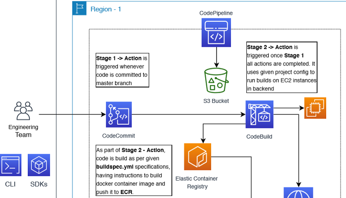

**Prepare `buildspec.yml` file**

1. Edit `buildspec.yml` file, located at `<<PROJECT_ROOT>>\references\buildspec.yml`
2. Replace <<YOUR_REPOSITORY_URI>> with your CodeCommit Repository URL - For example, *accountid*.dkr.ecr.*region*.amazonaws.com/*repository name*

**Setup CodeBuild Project**

1. Open the [CodeBuild console](https://console.aws.amazon.com/codesuite/codebuild/home).
2. On the **Build projects** page, choose **Create build project**.

    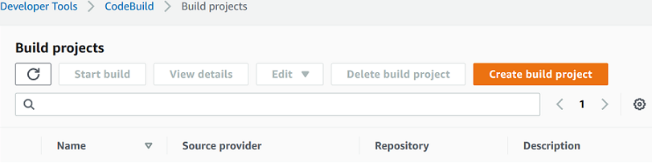

3.  In **Project configuration**: Enter a name for this build project (i.e. `tripmgmt-demo-build`). Build project names must be unique across each AWS account. You can also include an optional description of the build project to help other users understand what this project is used for.\
If required, Select **Build badge** to make your project's build status visible and embeddable.

4. In **Source**: For **Source provider**, choose **AWS CodeCommit**. 
5. From **Repository**, choose the **repository** you have created for this project demo.
6. For **Reference type**, choose **Branch** and select *master* branch.
7. In **Environment**: choose **Managed Image** with **Operating system** as  *Amazon Linux 2*, 
8. For **Runtime(s)** choose *Standard* and **Image** choose the one with Standard:2.0 with **Image Version** as *Always use the latest image for this runtime version*
9. For **Environment type** choose *Linux* and Check mark **Privileged** action.
10. For **Service role** choose **New service role** and give meaningful name i.e. *codebuild-tripmgmt-demo-build-service-role*
11. Under **Additional configuration**, for **Compute** choose right spec EC2 instance type to run your build.
12. For **Buildspec name - optional**, add buildspec.yml file location - i.e. *references/buildspec.yml*
13. For **Logs**, check mark *CloudWatch logs* and give **Group name** as *codebuild-logs*, **Stream name** as *tripmgmtdemo-build*.
14. Click **Create build project**.
15. Now edit newly created service role  *codebuild-tripmgmt-demo-build-service-role* to allow accessing ECR repository through *AmazonEC2ContainerRegistryPowerUser* managed policy.
    1. Open 'codebuild-tripmgmt-demo-build-service-role` role from [IAM console](https://console.aws.amazon.com/iam/).
    2. Choose **Attach policies**.
    3. To narrow the available policies to attach, for **Filter**, type **AmazonEC2ContainerRegistryPowerUser**
    4. Check the box to the left of the **AWS managed policy** and choose **Attach policy** and **Update**.
16. Select the build project and **Start build** to test CodeCommit and CodeBuild integration. Post successful build, you can verify new docker image in ECR Repository console.

### Setup CodeDeploy and CodePipeline with Amazon ECS on Amazon EC2

**Prepare create-service.json and Create Service**

Before we setup CodeDeploy Application, we need to create ECS Service, to be referred in CodeDeploy configuration.

ECS Service, runs and maintains a desired number of tasks from a specified task definition. If the number of tasks running in a service drops below the desiredCount , Amazon ECS runs another copy of the task in the specified cluster. In addition to maintaining the desired count of tasks in your service, you can optionally run your service behind one or more load balancers. The load balancers distribute traffic across the tasks that are associated with the service.

1. Edit `create-service.json` file, located at `<<PROJECT_ROOT>>\references\create-service.json`
    1. Replace <<TASK_NAME>> with previously created Task Definition, it should be of the form __ *taskname*:1__ (i.e. `task-tripmgmt-demo:1`)
    2. Replace <<ECS_CLUSTER_NAME>> with the ECS Cluster created in one of the above section (i.e. `ecs-cluster-tripmgmtdemo`)
    3. Replace <<ALB_TARGET_GROUP_ARN>> with the ARN of already setup Application Load Balancer's first Target Group Listner.
    4. Replace <<CONTAINER_NAME>> with the actual container name - refer task definition file (i.e. `cntr-img-tripmgmt`)
    5. Replace <<MULTIPLE_SUBNET_IDS>> with the subnet-ids used in earlier sections for Application Load Balancer setup. It should be of the form `"subnet-xx..", "subnet-xx.."`
    6. Replace <<MULTIPLE_SECURITY_GROUPS>> with the Security Groups used in earlier sections. It should be of the form `"sg-xx..","sg-xx..","sg-xx.."`. These security groups should allow Task communication from ALB and to other services used (i.e. Aurora RDS).

2. Create Service from commandline, here in place of <<SERVICE_NAME>>, give unique name to the service.

    ```sh
    aws ecs create-service --service-name <<SERVICE_NAME>> --cli-input-json file://create-service.json
    ```
3. Commit `create-service.json` in repository.
4. You can verify Service created in [Amazon ECS console](https://console.aws.amazon.com/ecs/), left navigation bar under **Amazon ECS**, **Clusters** and select the cluster name, you can see recently created service, status of the service and tasks.


**Create Your CodeDeploy Application and Deployment Group (ECS Compute Platform)**
	
Create a CodeDeploy application and deployment group for the Amazon ECS compute platform, the application is used during a deployment to reference the correct deployment group, target groups, listeners, and traffic rerouting behavior.

*To create a CodeDeploy application*

1. Open the [CodeDeploy console](https://console.aws.amazon.com/codesuite/codedeploy/applications/) and choose **Create application**.
2. In **Application name**, enter the name you want to use (i.e. `Deploy-Tripmgmt-Demo-App`)
3. In **Compute platform**, choose **Amazon ECS**.
4. Choose **Create application**.

    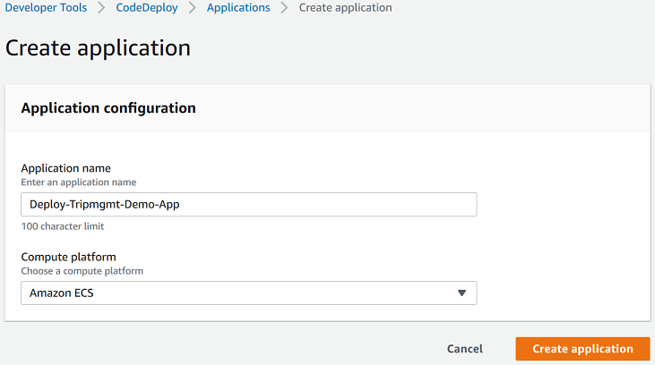

*To create a CodeDeploy deployment group*

1. On your application page's **Deployment groups** tab, choose **Create deployment group**.
2. In **Deployment group name**, enter a name that describes the deployment group (i.e. `deploygrp-tripmgmt-demo`)
3. In **Service role**, choose a service role that grants CodeDeploy access to Amazon ECS.
4. In **Environment configuration**, choose your Amazon ECS cluster name and service name.
5. From **Load balancers**, choose the name of the load balancer that serves traffic to your Amazon ECS service.
6. From **Production listener port**, choose the port and protocol for the listener that serves production traffic to your Amazon ECS service.
7. From **Target group 1 name** and **Target group 2 name**, choose the target groups used to route traffic during your deployment. Make sure that these are the target groups you created for your load balancer.
8. Choose **Reroute traffic immediately** to determine how long after a successful deployment to reroute traffic to your updated Amazon ECS task.
9. Under **Original revision termination**, make it 0 - 0 - 0 for Days, Hours and Minutes. As we are testing, we can terminate original tasks immediately after rerouting traffic.
10. Choose **Create deployment group**.

*Create Your Pipeline*

In this section, you create a pipeline with the following actions:

A source stage with CodeCommit action

A build stage with CodeBuild action

A deployment stage with an Amazon ECS deploy action where the deployment runs with a CodeDeploy application and deployment group.

1. Sign in to the AWS Management Console and open the [CodePipeline console](http://console.aws.amazon.com/codesuite/codepipeline/home)
2. On the **Welcome** page, **Getting started** page, or the **Pipelines** page, choose **Create pipeline**.
3. In **Step 1: Choose pipeline settings**, in **Pipeline name**, enter `codepipeline-tripmgmt-demo`.
4. In **Service role**, Choose **New service role** to allow CodePipeline to create a new service role in IAM. For example, enter name as `codepipeline-tripmgmt-demo-service-role`

    

5. In **Artifact store**, Choose **Default location** to use the default artifact store, such as the Amazon S3 artifact bucket designated as the default, for your pipeline in the region you have selected for your pipeline.
6. Choose **Next**.
7. In **Step 2: Add source stage**, in **Source provider**, choose **AWS CodeCommit**. In **Repository name**, choose the name of the CodeCommit repository (i.e. `tripmgmtdemo`). In **Branch name**, choose the name of the branch that contains your latest code update (i.e. `master`)

    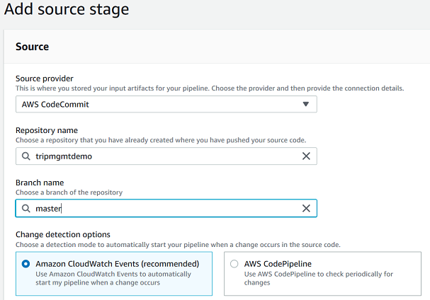

8. Choose **Next**.
9. In **Step 3: Add build stage**, in **Build provider**, choose **AWS CodeBuild**. In **Project name** choose the name of the build project. 

    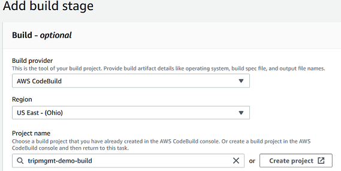

10. Choose **Next**.
11. Choose **Skip deploy stage** and let first build complete.
12. **Review**, review the information, and then choose **Create pipeline**.

*Add Deploy Stage*

1. Open the [CodePipeline console](http://console.aws.amazon.com/codesuite/codepipeline/pipelines)
2. Choose `default region` from top section.
3. Select the Pipeline name, For example `codepipeline-tripmgmt-demo`.
4. Click **Edit**, and scroll down and "Add Stage", give **Stage name** as `BlueGreenDeployStage`.
5. Click **Add action group**, in **Action name** give action name (i.e. `Deploy-Tripmgmt-Demo-ECR`).
6. In **Action provider**, choose **Amazon ECS (Blue/Green)**.
7. In **Input artifacts**, choose **SourceArtifact**
8. In **AWS CodeDeploy application name**, choose CodeDeploy Application name. In **AWS CodeDeploy deployment group**, choose CodeDeploy Application's Deployment Group. 

    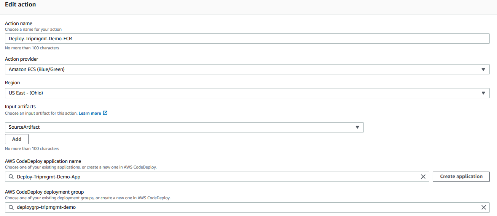

9. In **Amazon ECS task definition**, choose **SourceArtifact** and enter `references/taskdef.json`
10. In **AWS CodeDeploy AppSpec file**, choose **SourceArtifact** and enter `references/appspec.yaml`

    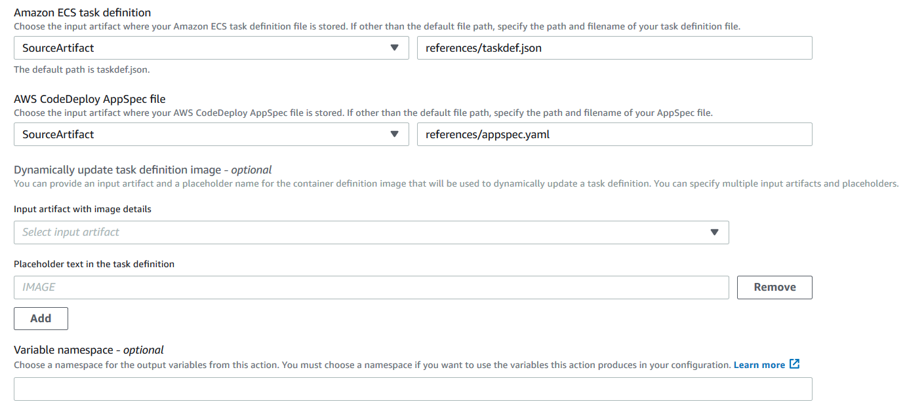

11. Choose **Done**
12. Choose **Save**
13. Test end to end CodePipeline through **Release change**. Post successful CodeCommit, CodeBuild and CodeDeploy Blue-Green deployment, CodePipeline dashboard and task replacement result in deployment should look like as below.

    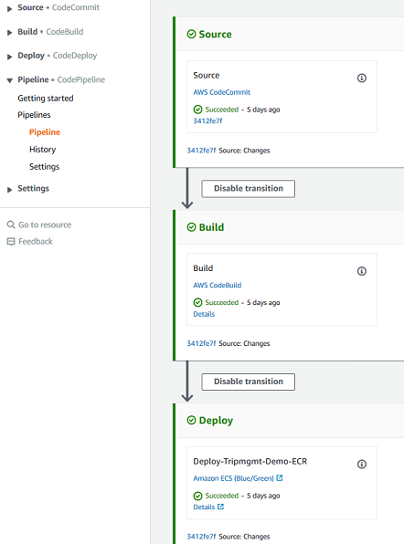
    \
    \
    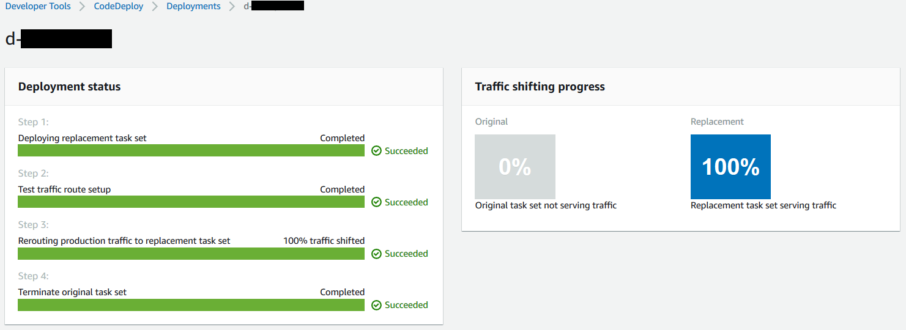


### Modify CodeDeploy and CodePipeline for Amazon ECS on AWS Fargate

We now have working end-to-end DevOps pipeline with Blue Green Deployment using Amazon ECS with Amazon EC2 launch type. As we have seen in above section, one of the overhead using EC2 launch type is to manage EC2 fleet of servers.

Let's modify our pipeline to use AWS Fargate launch type in Amazon ECS cluster.

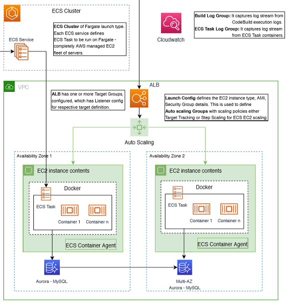

As per given architecture, portion highlighted in **Green** will be taken care by AWS Fargate. So, we don't require *Launch configuration*, *Autoscaling Groups*, *EC2 Instances* and *Capacity Providers for Autoscaling Groups*. 

**Stopping running Amazon ECS Service, which is using EC2 Launch Type**

1. Open [Amazon ECS console](https://console.aws.amazon.com/ecs/).
2. Left navigation bar under **Amazon ECS**, **Clusters** and select the cluster name.
3. Under **Services** tab, select the Service name to be removed and **Delete** it. Enter *delete me* under confirmation dialog box.
4. Tasks running under service, should be stopped. However, if it's not stopped, in 5-10 min, Go to **Tasks** tab, select all tasks and **Stop** them.
5. Optionally, you can also remove EC2 Launch type associated resources like *Launch configuration*, *Autoscaling Groups*, *EC2 Instances* and *Capacity Providers for Autoscaling Groups*.

**Launching Amazon ECS Service for AWS Fargate Launch type**

1. Edit `create-service.json` file, located at `<<PROJECT_ROOT>>\references\create-service.json`, with provided diff changes as given below.

    ```diff
    - "launchType": "EC2",
    + "launchType": "FARGATE",

    - "assignPublicIp": "DISABLED"
    + "assignPublicIp": "ENABLED"
    ```
2. Create Service from commandline, here in place of <<SERVICE_NAME>>, give unique name to the service, preferrbly even not used previously.

    ```sh
    aws ecs create-service --service-name <<SERVICE_NAME>> --cli-input-json file://create-service.json
    ```
3. Commit `create-service.json` in repository.
4. You can verify Service created in [Amazon ECS console](https://console.aws.amazon.com/ecs/), left navigation bar under **Amazon ECS**, **Clusters** and select the cluster name, you can see recently created service, status of the service and tasks.

    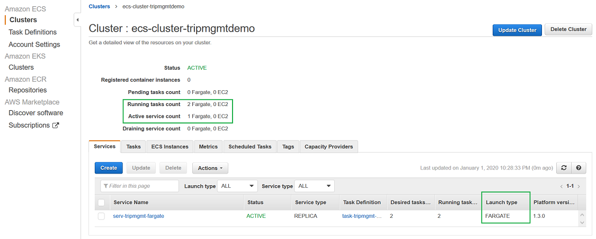


**Adding newly created Amazon ECS Service in CodeDeploy Deployment Group**

1. Open the [CodeDeploy console](https://console.aws.amazon.com/codesuite/codedeploy/applications/) and choose deployed Application name.
2. Under **Deployment groups**, select Deployment Group name and **Edit** it.
3. Under **Environment configuration**, in **Choose an ECS service name**, select AWS Fargate launch type service created above.

    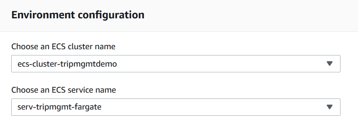

4. Under **Advanced - optional**, in **Rollbacks**, check mark **Disable rollbacks** as we are testing the deployment.
5. Choose **Save changes**

**Testing CodeDeploy and CodePipeline for Amazon ECS on AWS Fargate**

1. Open the [CodePipeline console](http://console.aws.amazon.com/codesuite/codepipeline/pipelines)
2. Choose `default region` from top section.
3. Select the Pipeline name, For example `codepipeline-tripmgmt-demo`.
4. Either modify, commit and push changes in CodeCommit Repository OR **Release change** to test the CodePipeline.
5. Once **Source stage** and **Build stage** completes and **Deploy stage** starts, click on **details**.
6. Blue Green deployment takes place, having first **Replacement tasks** getting created (*pending* state) with new deployment.

    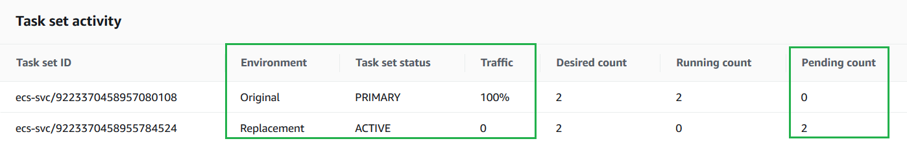
    \
    \
    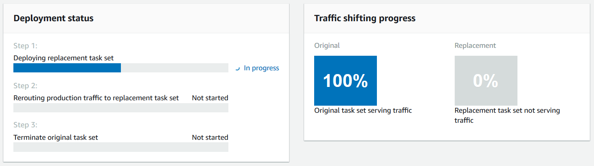

7. AWS Fargate completes deploying new deployment in newly created tasks.

    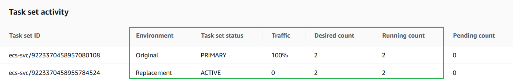

7. As next step, traffic switch over from **Original tasks** to **Replacement tasks** and then **Original tasks** are terminated.

    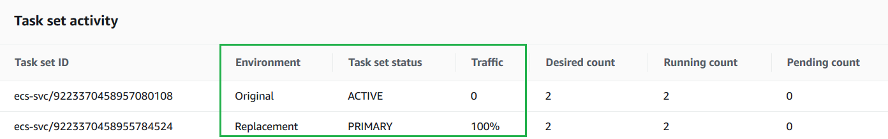
    \
    \
    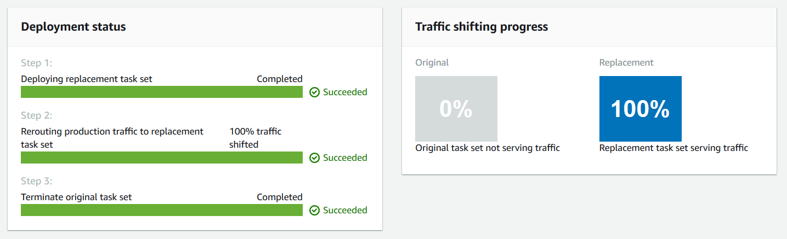

8. Hurray !!! You have successfully tested CodeDeploy and CodePipeline for Amazon ECS on AWS Fargate.


[Project Home](README.md)
